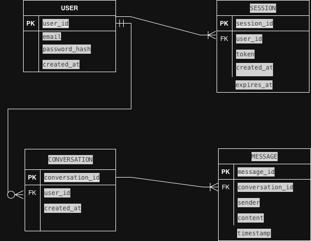
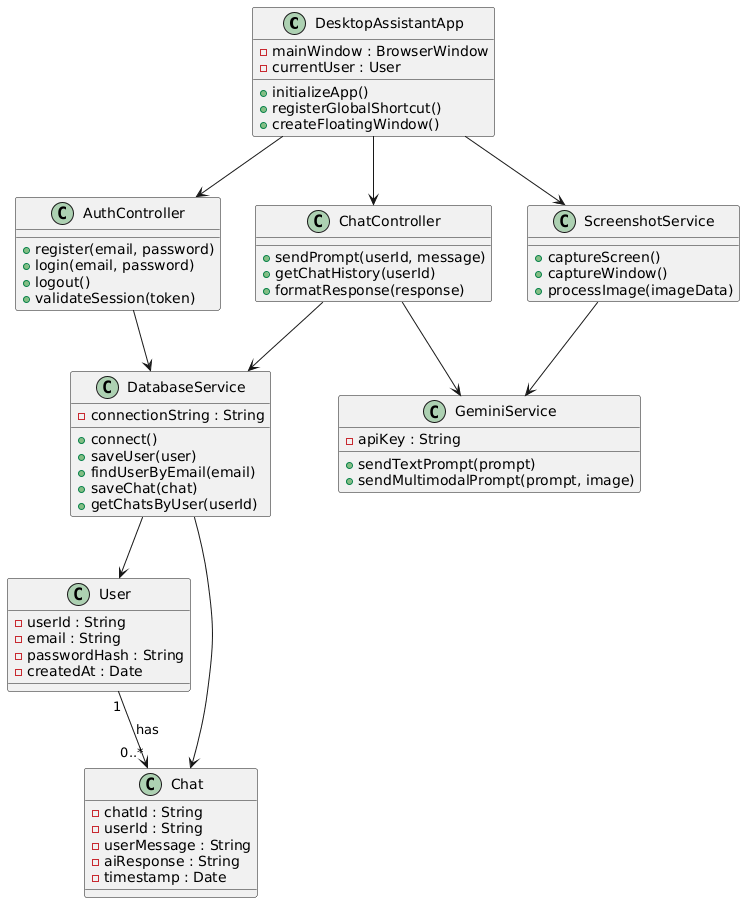
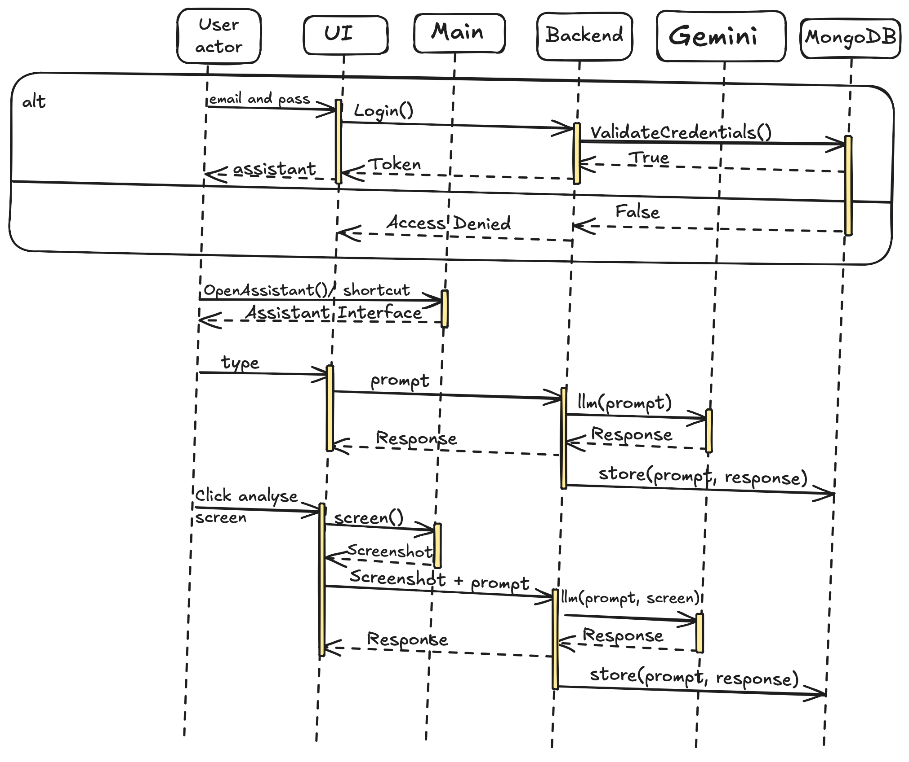
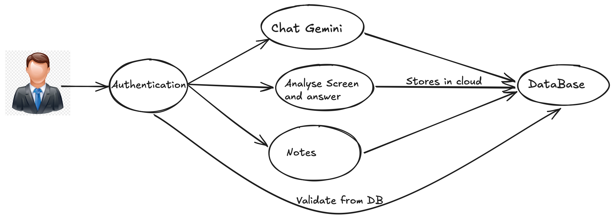

# Desktop AI Assistant

## About the Project
The **Desktop AI Assistant** is a lightweight AI-powered macOS desktop application built using **TypeScript + Electron**. It provides real-time AI assistance directly on the user’s screen through a floating interface that works independently of browsers. Unlike traditional web-based AI tools, this assistant integrates deeply with the desktop environment, offering contextual help, screenshot-based analysis, secure user authentication, and persistent chat history storage.

## Features
- **User Authentication System:** Secure registration, login, and personalized chat sessions.
- **Persistent Chat Storage:** Stores every chat securely in MongoDB for future reference.
- **Floating Desktop Interface:** Minimal, distraction-free UI with always-on-top capability.
- **Global Shortcut Activation:** Trigger the assistant instantly from anywhere without switching applications.
- **Screenshot-Based Context Awareness:** Captures the current window or full screen and sends image data to Gemini for contextual analysis.
- **AI Chat Engine:** Integration with Google Gemini API for structured prompt handling and Markdown rendering support.
- **Privacy-Oriented Design:** Not browser dependent, offering secure local session handling.

## Tech Specs
| Component | Technology |
|-----------|------------|
| Desktop Framework | Electron |
| Language | TypeScript |
| Backend Layer | Node.js |
| AI Engine | Google Gemini API |
| Database | MongoDB |
| Authentication | JWT / Secure Session Handling |
| UI Layer | HTML / CSS |
| Screenshot Capture | Electron APIs |
| Build System | Electron Builder |

## ER Diagram

## Class Diagram

## Sequence Diagram

## Use Case Diagram
